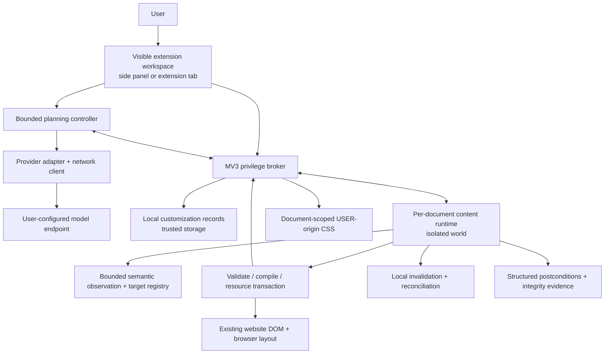

# Revueon master blueprint

**Status: Proposed target architecture; not implemented.** This document defines the system to build. [Repository audit](01-repository-audit.md) describes what actually exists. Product authority: [all-about_revueon.txt](../all-about_revueon.txt), supplemented by the requirement that users can connect different models without changing runtime correctness.

## 1. Product and success definition

Revueon is a browser extension that lets a person reshape a website's appearance, layout, navigation, interactions, keyboard access, and workflows using natural language, while retaining the site's original content, controls, and backend behavior. It is not merely a CSS generator, a userscript generator, a replacement browser, or an autonomous account-action bot.

The model interprets intent and proposes transformations. The runtime resolves targets, validates proposals, owns effects, verifies observable postconditions, and reverses its own effects. The browser remains the layout engine. A weak model can produce a less attractive or less complete proposal, or fail to produce one; it cannot bypass validation, invent privileges, disable undo, or cause an unlimited retry loop. “Any model works” means any supported protocol/model combination participates in this contract; no engineering system can force an arbitrary model to understand every request.

### Product requirements

| ID | Requirement | Product interpretation |
|---|---|---|
| R01 | Natural-language transformation | Broad requests get an actionable proposal, targeted questions only for materially different interpretations |
| R02 | Appearance, density and visual detail | Coherent typography, colors, backgrounds, spacing, layout detail and native motion; no hardcoded style-pack/property ceiling |
| R03 | Layout and navigation | Browser-native flex/grid, floating existing surfaces, linked alternative views |
| R04 | Behavior and shortcuts | Declarative bindings to existing controls and extension-owned presentation state |
| R05 | Workflow recomposition | Local Kanban/dashboard/mini-player experiences linked to the real site, not cloned interactive DOM |
| R06 | Preserve functionality | Original nodes, event listeners, forms, media, focus and site state remain intact except explicitly approved changes |
| R07 | Continuous customization | Saved rules apply to compatible new content and routes without model calls |
| R08 | Reversal and control | Stop, per-customization disable, undo latest revision, remove; report conflicts rather than overwriting site changes |
| R09 | Provider/model substitution | Configurable endpoints/models, bounded protocol negotiation, identical execution contract |
| R10 | Speed and resource discipline | One planning call on the common path; bounded main-thread work; zero idle/model polling |
| R11 | Privacy and permission | Explicit disclosure, minimal page evidence, local persistence, per-site permission |
| R12 | Honest outcomes | Applied, partial, unsupported, interrupted, unsaved and restoration-conflict states are distinct |
| R13 | Accessibility and responsiveness | Keyboard/focus support, reduced motion, real viewport testing, no production window resizing |
| R14 | Maintainable implementation | Typed contracts, one effect owner, reproducible fixtures, resumable task ledger |
| R15 | New elements and owned graphics | Generic native UI creation/insertion and bounded owned Canvas 2D; original website canvas internals remain a separate capability boundary |

### Capability boundaries, not a reduction of the vision

Every example in the vision has a delivery path in [behavior/workflows](09-behavior-and-workflows.md) and [traceability](26-traceability.md). Ship increasingly expressive, tested capabilities rather than pretending every site is controllable today. Closed shadow roots, protected browser pages, unexposed canvas internals, DRM internals and actions requiring trusted activation are explicit unsupported boundaries. A website that continuously fights DOM changes is degraded to presentation-only or a linked view. Do not silently reinterpret “Kanban board” as “different card colors.”

## 2. Architecture

Four concrete boundaries, not a distributed service platform:

1. **Visible extension workspace** owns active planning, provider calls and human interaction. Replace the ephemeral-popup-as-session design. A side panel is the default on supported Chromium; an extension tab hosts the same workspace as fallback. Closing it cancels unfinished planning; already accepted customizations continue locally. No hidden offscreen inference host or keepalive hack.
2. **MV3 broker** owns privileged API calls, permission checks, document registration, origin-record writes, and CSS delivery receipts. It is restartable infrastructure, not a five-minute autonomous agent process. Every handler waits for storage rehydration; listeners register synchronously.
3. **Per-document runtime** owns page observation, target evidence, all local effects and inverse records, verification, and dynamic reconciliation. It has exactly one mutation queue. Native event handlers may perform only their documented bounded behavior transactions. No provider/network logic.
4. **Pure contracts and policies** own schemas, limits, operation definitions and deterministic decisions. They import neither DOM nor extension APIs. No service locator, general plugin framework, virtual DOM for the page, or layout solver.

[Layers](02-layers-and-dependencies.md) fixes dependency direction; [module contracts](03-module-contracts.md) names implementation files.

## 3. Source of truth

| Information | Authoritative owner | Not authoritative |
|---|---|---|
| Website content and native application state | Live website DOM/application | Snapshot, model prose, saved inverse from a prior page |
| User's saved customization intent | Versioned per-origin record in local storage | Conversation history or concatenated CSS from prior runs |
| Effects currently applied in a document | Runtime resource ledger + broker delivery receipts | Saved customization list alone |
| Active request and provider budget | Workspace planning controller | Popup lifetime, model “done” |
| Target identity this document | Runtime target registry and current node/root evidence | CSS match count alone, text hash alone, model confidence |
| Safety/verification result | Structured report for exact revision and page epoch | A prior clean flag, missing data, screenshot checksum |
| Progress | [Checkbox roadmap](25-roadmap.md), evidence-linked completion records | Chat history |

No durable DOM clones. No persisted observations by default. Saved model-authored text may contain sensitive information and is treated as content, not magically safe because a model produced it.

## 4. Execution lifecycle

1. User selects the exact tab/site, grants page and provider permissions, and submits a goal.
2. Broker binds a run to `(tabId, frameId, documentId, routeEpoch)` and one workspace owner. No fallback to an arbitrary tab.
3. Runtime captures a bounded semantic snapshot, actions available on targets, current customization summary and explicit coverage gaps. This is automatic, not a paid “please observe” turn.
4. Planner sends this evidence and a small capability-specific response contract to the selected provider. Response is `proposal`, `requestEvidence`, `question`, or `cannotComplete`—never executable code.
5. The runtime validates the entire proposal, resolves target references, checks dependencies/risk/budgets, and returns an exact preview/diagnostic. Permission is derived from the user grant, never a model field.
6. User approval is required for content rewriting, behavior installation with consequential actions, structural moves, broader persistence scopes and uncertain targets. Ordinary reversible presentation changes within the requested region may auto-preview.
7. Runtime prepares resource transactions and a canonical per-root aggregate stylesheet; new candidate CSS effects are staged **inert** behind unique runtime target tokens, while unchanged accepted fragments retain identical semantics. Inverses exist before effects. A synchronous local commit rechecks the actual local route and has no intervening await. Cross-context delivery is reconciled by operation IDs, not assumed atomic.
8. Verification inspects the single candidate batch, baseline sentinels and its interaction with existing customizations. Accept all operations together or roll back the candidate; no optional-group dependency graph. An unavailable verifier is `unknown`, not clean. The accepted prior revision is preserved.
9. Accepted effects become a new customization revision. Persistence acknowledgement is separate: save failure means **applied this session, not saved**. A model outage cannot remove an accepted revision.
10. Local mutation/route/resize observers reconcile compatible rules. They never call a model. Missing or ambiguous targets wait/suspend with an explanation; repair requiring interpretation is offered to the user.

Details: [state](05-state-and-lifecycle.md), [events](06-events-and-concurrency.md), [runtime](08-transformation-runtime.md), [replay](13-persistence-and-replay.md).

## 5. Transformation representation

A versioned **Customization** contains a user-approved scope, target descriptors and one ordered batch of typed operations per revision. The operation language is data, not a programming language:

- presentation: style declarations, conditional responsive styles, hide/collapse, safe floating placement;
- local content: leaf-text replacement and generic owned element trees (containers, cards, controls, annotations), inserted before/after/inside a verified anchor;
- visual detail: native CSS typography, surfaces, layout, micro-details and motion rather than one tool per property;
- graphics: optional bounded owned Canvas 2D drawings, not arbitrary access to an existing site's canvas/WebGL internals;
- interaction: focus, scroll, explicit existing-control activation and key bindings;
- recomposition: projection of observed items into extension-owned list/grid/board views with source links, plus separately gated native-node relocation.

An “effect group” means the single batch belonging to one revision, not another model-authored orchestration layer. Validate the complete ordered operation list; apply and verify as one transaction. No required/optional flags, graph scheduler or silent filtering. A smaller useful change must be an explicitly smaller proposal. Replacement records retain both underlying-site baseline and predecessor state, so failed refinement restores the predecessor but disable restores the site. See [operation contracts](08-transformation-runtime.md) and [data](04-data-contracts.md).

## 6. Failure and recovery boundaries

- Malformed model data: no effects; one format repair, then a safe failed proposal. No provider silently substituted.
- Stale document/route: reject; cancel the old run. Never redirect an old message into the current tab document.
- Unknown privileged delivery: query/compensate the existing operation ID; do not retry with a new ID.
- Missing verification: provisional group is rolled back; previous accepted state stays.
- Site changed a field Revueon also changed: compare-and-restore declines to overwrite the site's new value; mark conflict and disable that group.
- Worker/workspace loss: document runtime disarms provisional tokens and rolls back provisional local writes when its lease expires. Accepted local work stays; no automatic paid resumption.
- Reload/SPA: fresh targets and resources are constructed from saved intent, never old operation transcripts.

A runtime cannot promise byte-identical restoration of an independently mutating page. It can promise to release its own resources and never knowingly overwrite unrelated new site state. [Failure ladders](14-failure-and-fallbacks.md) make this explicit.

## 7. Strategy and priorities

**Recommended: subsystem rewrite, preserving the platform and useful pure primitives.** Keep WXT, TypeScript, native DOM, Web Crypto, Playwright and axe. Rewrite orchestration, targeting contracts, execution ownership and persistence. Reuse observation/color/serialization ideas only after focused correctness tests. Do not transplant the 1,124-line loop into renamed directories.

P0: executable tests, contracts, permission boundaries, document lifecycle and effect ownership. P1: safe presentation, replay, provider substitution and usable workspace. P2: behavior, linked workflows and broader root/frame support. P3: optional optimization and additional protocol transports. P2 product features have explicit work, not indefinite “future” placeholders. [Roadmap](25-roadmap.md) defines dependency order and release gates.

## 8. Simplicity and capability coverage

The [physical layout](02-layers-and-dependencies.md) consolidates related responsibilities instead of creating one file/class per contract heading. Providers use a few explicit adapter functions, observation uses one bounded path, and native CSS/DOM cover ordinary styling and element creation. Implementation evidence belongs in one compact progress log, not a report bureaucracy. No DAG engine, widget-per-tag framework, animation library, canvas scene framework, server or new agent framework.

[Capability coverage](28-capability-coverage.md) maps colors, backgrounds, spacing, typography, element creation/insertion, behavior, layout, motion, micro-details and canvas to concrete tasks/tests and honest limits. New drawing and generic insertion were gaps in the first draft, now explicit. This is a plan, not a claim those capabilities already exist in the current source.

## 9. Engineering principles

- General mechanisms, not hardcoded site recipes; evidence-based site adapters only when the generic mechanism demonstrably cannot expose required semantics.
- Runtime guards enforce safety; prompts explain contracts but grant nothing.
- Observation is read-mostly and incremental; no global cluster stamping or six-second synchronous scan.
- Browser-native layout first, with actual responsive tests rather than counting `px` tokens.
- One owner for each mutable resource; exact acknowledged outcomes, including unknown.
- Model/provider quality is measured separately from runtime correctness and runtime latency.
- No architectural drift by benchmark patch. Changes to these boundaries require an ADR amendment and failure tests.
