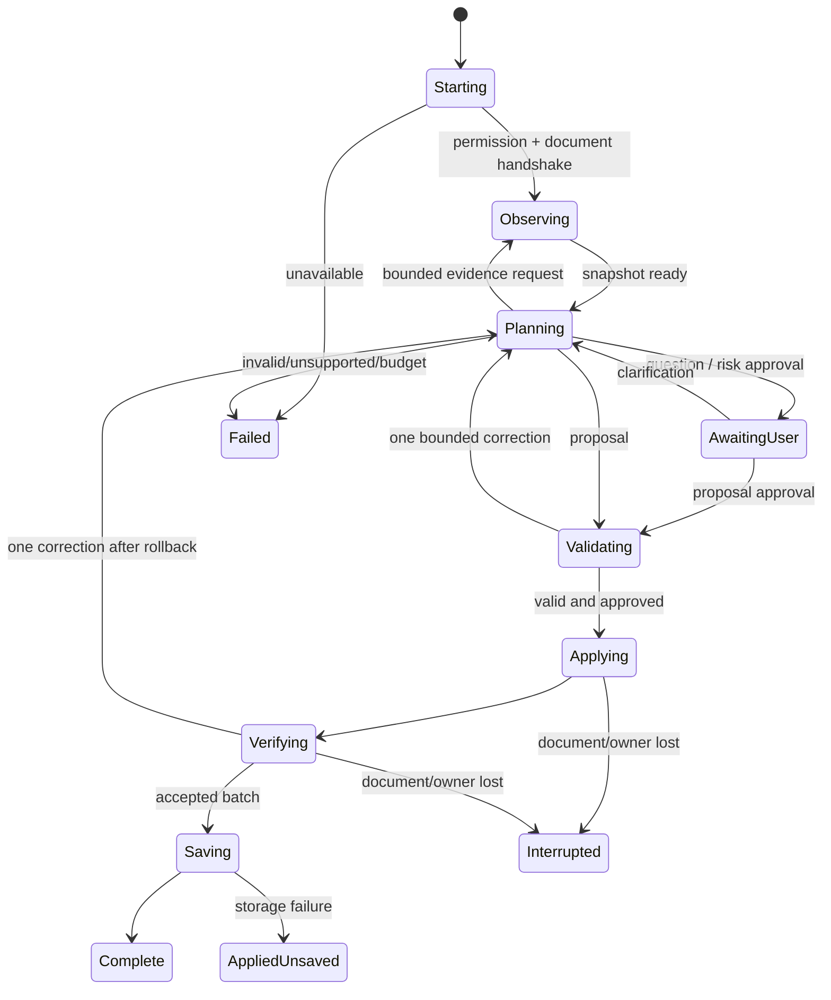

# State ownership and lifecycle machines

**Proposed.** Scope: user run, document runtime, one ordered effect batch per revision, saved revisions and cancellation. [Data fields](04-data-contracts.md) and [event ordering](06-events-and-concurrency.md) are normative companions.

## 1. State inventory

| State | Sole owner | Persistence / invalidation |
|---|---|---|
| Goal draft, selected model/tab | Workspace | Draft may be saved explicitly; selected tab must be revalidated |
| Active planning run, request budget, pending question | Workspace controller | Ephemeral; session projection for UI reconnection, never automatic paid restart |
| Permission grants, enabled customization, revisions | Broker store | Local versioned OriginRecord; revoke invalidates active groups |
| Document identity/route epoch | Broker + runtime handshake | Session metadata; browserDocumentId authoritative, runtime detects local URL invalidation |
| Resolved targets, evidence, style samples | Runtime | Epoch-scoped cache/WeakMap; invalidated by dirty roots |
| Provisional/accepted resource ledger | Runtime; broker for CSS delivery portion | Local live references; broker session receipts sufficient to remove delivered CSS after restart |
| Keyboard listeners/projection widgets | Runtime | Rebuilt from accepted/saved intent; never restored from serialized closures |
| Diagnostics | Each owner produces; workspace displays | Bounded session ring, no raw content by default |

`enabled` is saved intent. `applied` is measured live state. They are not interchangeable. UI may say “enabled, waiting for target” or “disabled, cleanup conflict.”

## 2. Run state machine

From any nonterminal state, user Stop requests `Cancelling`; no new planning/activation is allowed, pending provider requests are aborted, provisional resources are disarmed/rolled back. Terminal status is `Cancelled` if cleanup confirmed, `CancelledWithConflict` otherwise. Previously accepted revisions survive. Closing workspace follows the same policy, enforced by runtime lease even if unload messages fail. AwaitingUser has no model in flight and releases the document planning reservation after recording its snapshot revision; accepting later must revalidate.

### Transition rules

| Trigger | Required guard | Side effect / next state |
|---|---|---|
| Start | Exact target selected, eligible URL, permissions, one owner | Broker registers run, runtime prepares observation |
| Model response | Same run, not cancelled, deadline valid | Decode union; no mutation on arrival |
| Proposal valid | Every operation/ref/risk approval valid, current targets | Reserve batch resources and stage |
| Verification pass | Report matches current revision/epoch; all operations and combined mandatory checks pass | Accept candidate batch; no partial operation acceptance |
| Required verification fail | Any operation or mandatory check fails in candidate | Roll back whole candidate revision, retain previous accepted state |
| Verification unknown | Recheck once within local budget | If still unknown, roll back provisional group, return incomplete |
| Save ack | OriginRecord revision/mutation ID matches | Complete with saved badge |
| Save failure | Accepted live effects retained | AppliedUnsaved, explicit retry save/undo |
| Late model/tool reply | Run cancelled or epoch mismatched | Ignore planning reply; reconcile any resource receipt, never execute again |

Invalid transitions: complete→apply; unknown verification→accepted; stale question→apply without revalidation; provider retry→new operation ID for already submitted mutation; old route reply→current route commit.

## 3. Document runtime machine

States: `booting`, `ready`, `reconciling`, `applying`, `suspended`, `disposing`, `disposed`.

- Boot registers message listeners once, then handshake/permissions. Body may not exist. No DOM walk until document root and necessary anchors exist.
- Ready has no background scan unless customizations are installed or evidence requested.
- Applying takes the serial mutation slot. Observers only mark dirty; they do not mutate recursively.
- Reconciling processes dirty targets in bounded slices. It does not regenerate model decisions.
- Suspended on BFCache `pagehide.persisted`/hidden-pressure conditions: no new interactions or provisional commit. Disarm provisional state. On `pageshow`, query broker and fresh epochs before resuming accepted groups.
- Disposing revokes token namespaces and listener triggers first; then releases resources. Disposed rejects all commands.
- Same-document navigation increments routeEpoch before any awaited work. Cancel old run, disarm out-of-scope resources, clear target/evidence caches and queue new-scope reconciliation. Origin-wide customizations remain logically enabled but are re-resolved against the new route.

DOM mutations increment domRevision when relevant, not for every owned token change. An unrelated clock widget does not starve all operations; commit validates the affected target dependencies even if global domRevision advanced. A route/document change always invalidates the whole proposal.

## 4. Single-batch transaction machine

`candidate → validated → prepared → staged → active-provisional → verified → accepted`.

Failure before active: release staged resources, `not-applied`. Failure after active: `rolling-back → rolled-back | conflicted`. A broker timeout yields `delivery-unknown`; disarm all associated tokens, reconcile exact operation, then enter rolled-back or conflicted. Nothing transitions directly from delivery-unknown to accepted.

The single candidate batch stays provisional until its full mandatory verification passes. No nested groups, dependency DAG or optional-subset execution. “Group” in resource diagnostics is simply the revision batch. A smaller useful result needs a smaller explicit proposal; cleanup conflict is still an honest partial physical outcome, never successful partial execution. Resource preparation records each inverse and write expectation **before** its side effect. The ledger is authoritative even if the caller's response is lost. `accepted` carries a verification revision. A subsequent user refinement is a new revision, never mutation of the accepted receipt. On replacement, resources of previous revision remain available until the new revision is verified; visible effects are swapped in a bounded transaction, not layered forever.

## 5. Multi-customization state

Presentation groups may overlap. Deterministic precedence is explicit customization order (later user order wins), then operation order; declared viewport conditions do not change ownership. Runtime composes logical fragments into one ordered accepted stylesheet per root, with at most one staged replacement bundle and normalized generated selector specificity. Updating an earlier customization cannot move it to the end of cascade precedence. Compiler creates consistent specificity so source order is meaningful. Structural/text/binding conflicts are detected by `(root, live target, resource category, property/key)` claims:

- Same customization revision replacement may take over its previous claims.
- Two different customizations rewriting same Text node, moving same node, or claiming same shortcut cannot coexist silently. Preview asks to replace/disable conflicting group or cancel.
- A stylesheet is not undone by deleting another customization's identical CSS: resource identity includes customization/revision/group/document tokens.
- Replacing a resource preserves two baselines: failed candidate rollback restores predecessor effective value; accepted disable/remove restores underlying site baseline inherited from first ownership. Never discard the site baseline during revision replacement.
- Undo latest revision restores previous accepted revision by revalidation, not replay of historical model tool calls. If the page no longer supports that revision, report suspended instead of inventing a match.

## 6. Scope of Stop, disable, remove and undo

| Command | Saved intent | Live behavior |
|---|---|---|
| Stop run | Unchanged | Abort planning; undo provisional only; keep accepted |
| Disable customization | enabled=false, acknowledged save | Disarm/remove all its current resources in each registered applicable document |
| Remove customization | Tombstone/delete after save ack | Same cleanup; retains conflict diagnostic until document disposal |
| Undo latest revision | Previous accepted revision selected after validation | Release new revision and restore previous within one managed replacement |
| Emergency disable site | All origin customizations disabled; stop origin runs | Revoke all runtime tokens/listeners first, retry CSS cleanup, offer reload if unresolved |

Save or browser API failure does not silently advance UI flags. Disable immediately disarms local triggers even if durable save fails; UI says “off in this tab; disabling across reloads failed,” offers retry. Other tabs remain separately reported until acknowledgements arrive.
