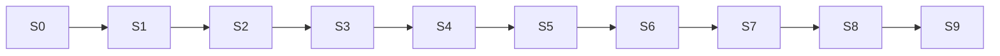

# Dependency-ordered implementation roadmap

**Persistent implementation state. All tasks below are not started.** Architecture documentation completion does not complete product implementation. Follow [protocol](24-implementation-protocol.md); use [module contracts](03-module-contracts.md), [matrix](21-test-matrix.md) and [acceptance](22-acceptance-criteria.md).

## Current checkpoint

- Current phase: **S6 — model independence, workspace and core cutover**.
- Next task: **S6.3**.
- Active task: none.
- Completed: S0.1 through S6.2 (see `plan/progress.md`). S5 delivered durable continuity (record owner + route-aware replay); S6.1 delivered `providers.ts` and `planning/controller.ts`; S6.2 delivered the shared workspace (`ui/workspace.ts` + `diagnostics.ts` + sidepanel entrypoint with extension-tab fallback): exact target pinning with persisted revalidated selection, provider profiles + endpoint-scoped consent + real opt-out, question/approval UX, always-available Stop, truthful status projection, customization list (enable/disable/remove/undo-latest/scope), diagnostic panel, and the full apply→save→replay user workflow proven end-to-end against a canned local provider in the browser suite. Read-only workspace discovery added to the protocol (ListDocuments/GetState, ADR-14).
- Known baseline blockers: none. Residual: `npm run bench` references the absent old bench harness (deferred); the legacy F05 recovery clause stays known-red until the plan/19 cutover deletes that path; streaming + capability-probe connection tests deferred from S6.1 (recorded); reconciliation set-membership changes re-apply whole customizations (bounded by the conflict pause); the legacy popup stays the toolbar default until the S6.3 cutover switches entrypoints (the v2 workspace is reachable as sidepanel + tab today); the legacy run overlay (a full-page blocker during legacy runs) is deleted with that cutover (I22).
- Planning baseline: dirty `main` at `71263e0938e0a3d3a2a5e7a44d2175898b9e8c0b`; owner's changes preserved.
- Evidence: `plan/progress.md` (one compact log).
- Simplicity: follow consolidated physical files in document 02. Detailed module names below are logical responsibilities, not mandatory files/classes. One ordered batch per proposal; no subgroup DAG. Capability coverage including insertion/motion/canvas is in document 28.
- Implementation selection: next unchecked task with prerequisites satisfied. No dependencies may be waived by changing checkboxes.

## Dependency graph

Provider adapters may be developed in isolation after S1, but S6 cannot complete before runtime/persistence integration. No P2 feature blocks P0 foundations. Phase numbers are order; P0/P1/P2 labels are priority/severity.

## Phase exit and rollback contracts

| Phase | Objective / why it exists | Prerequisites and exact scope | Exit validation / failure condition | Rollback / next dependencies |
|---|---|---|---|---|
| S0 P0 | Restore trustworthy evidence before changing architecture | Current tree; actual Node/Playwright harness, lint/import/build inventory | Nonzero deterministic tests; missing/stale suites fail; don't claim current defects fixed | Revert only task-owned harness/config edits; S1 depends on gates |
| S1 P0 | Fix data/authority contracts before execution | S0; schemas/errors/limits and trust/disclosure boundaries | T02/T04/T21/T25 contract tests; failure if unknown input grants authority | No enabled v2 effects yet; S2/isolated provider work depend on contract |
| S2 P0 | Establish document and privileged effect ownership | S1; broker hydration, runtime identity/queue, style intent/receipt | T08/T14 fencing/restart/duplicate tests; failure if late insert can activate | Disarm namespaces and remove task resources; S3/4 depend on handshake |
| S3 P0/P1 | Replace unsafe/expensive observation targeting | S2; one bounded collector + target registry/root support baseline | T03–T06; failure if coverage lies or wrong node resolves | Keep isolated old runtime only in separate test document; S4 consumes refs |
| S4 P0/P1 | Deliver reversible tested local transformation vertical slice | S3; compiler, policy, style/hide/text/generic insertUI transaction and verifier | T07–T09/T13/T30/T31; failure if partial mutation unowned or missing verifier passes | Release v2 groups, restore accepted predecessor; S5 uses same apply/replay path |
| S5 P1 | Make accepted work durable and dynamic | S4; OriginRecord writer + saved-intent reconciliation/scope | T10–T12/T26; failure if stale history replay/leak/duplicate/lost update | Disable v2 replay, preserve/quarantine records; no legacy auto-replay; S6 integrates user flow |
| S6 P1 | Replace model lock-in and popup lifecycle; core cutover | S5; adapters/controller/workspace/consent/status, remove old live runtime | T19–T21/T27/T29 + AC01–10 applicable; failure if strong model required for safety | Explicit package/dev runtime rollback only after cleanup/reload; v2 state never down-converted; S7 features depend on core |
| S7 P2 | Add actual keyboard/local behavior | S6; approved action catalog/bindings/disclosures finite rules | T15/T16 and AC11; failure if editing intercepted or external action auto-replayed | Disable capability and owned listeners; core presentation remains; S8 projections consume actions |
| S8 P2 | Deliver workflow/graphics breadth and floating existing controls | S7; source-linked projections, floating/guarded relocation, owned Canvas 2D | T17/T18/T28/T32 and AC12; failure if source fiction/cloned controls/lost playback | Remove projection/revert local group; retain original UI; S9 validates full product |
| S9 P1/P2 release | Harden measured performance/compatibility and complete deletion | All previous; stress/soak/platform matrix/legacy cleanup/manual quality | All applicable acceptance, no P0; unsupported features honestly excluded | Revert release package/task only, no destructive storage downgrade; future evolution via ADR |

Each phase also requires updated plan/current-fact docs and dependency/link checks before parent checkbox completion.

---

## S0 — Evidence foundation

Read: [audit](01-repository-audit.md), [testing](20-testing-strategy.md), [migration](19-migration-and-deletion.md).

- [x] **S0 phase completed**
  - [x] **S0.1 — Restore executable baseline and architectural gate**
    - Goal/inputs: current source/config/lockfile and F01/F21–F24 evidence; preserve dirty baseline.
    - Changes: establish real unit/browser fixture harness; fail zero-test/missing/stale builds; fix current lint errors without changing product contracts; add resolved import gate using installed TypeScript; document exact commands.
    - Outputs: runnable scripts/tests, fresh built-extension smoke, baseline regression fixtures for wrong-target/clone/missing-verifier/late-dispatch failures.
    - Invariants: I27/I28; test harness cannot bypass production broker/runtime path under test.
    - [x] Tests: T01/T29 negative controls and relevant existing pure-helper baseline.
    - [x] Validation: typecheck/lint/build plus test counts recorded; known defects explicitly red/characterized, not hidden.
    - [x] Completion: S0.1 entry in `plan/progress.md` records working commands, source SHA and baseline; no references to absent historical proof as current evidence.
    - Follow-up: S1 contracts become safely testable.

## S1 — Contracts and trust boundaries

Read: [data](04-data-contracts.md), [security](17-security-and-privacy.md), [layers](02-layers-and-dependencies.md).

- [x] **S1 phase completed**
  - [x] **S1.1 — Define versioned operation/message/provider/record schemas**
    - Goal/inputs: master requirements and data tables; S0.1.
    - Changes: unknown→validated DTO decoders, finite operation metadata, IDs/epochs/receipts, ordered batch/local-ref validation, structured error taxonomy, named limits. No nested groups or dependency graph executor.
    - Outputs: contracts consumed by tests/prompt metadata; no live unimplemented capabilities advertised.
    - Invariants: I01/I04/I11/I13/I20/I27.
    - [x] Tests: T02; nested graph fields/duplicate or forward local refs/missing target/version/unknown fields/bounds/ambiguous JSON negative cases.
    - [x] Validation: import gate proves contracts have no DOM/extension/fetch dependencies.
    - [x] Completion: schemas and conceptual examples agree, all decoding tests pass; evidence S1.1.
    - Follow-up: S1.2/S2 and isolated provider adapter development.
  - [x] **S1.2 — Implement trust/grant/privacy boundary foundation**
    - Goal/inputs: S1.1; security disclosure/endpoint rules.
    - Changes: sender-role validation, TRUSTED_CONTEXTS storage access, explicit grant/disclosure versions, field-level evidence filtering, exact endpoint/redirect/auth validation.
    - Outputs: denied-by-default permission functions usable by broker/workspace; existing implicit consent not accepted as v2 grant.
    - Invariants: I18/I19/I24.
    - [x] Tests: T04/T21/T25 sentinel and forged-authority cases.
    - [x] Validation: model/page `consent` cannot authorize, no credential in content DTO.
    - [x] Completion: trust boundary tested through simulated actual extension sender metadata; evidence S1.2.
    - Follow-up: broker can accept narrowly privileged requests.

## S2 — Lifecycle and privileged ownership

Read: [state](05-state-and-lifecycle.md), [events](06-events-and-concurrency.md), [browser](12-browser-runtime.md), [fallbacks](14-failure-and-fallbacks.md).

- [x] **S2 phase completed**
  - [x] **S2.1 — Build document broker/runtime bootstrap and serialized queue**
    - Goal/inputs: S1; DocumentKey/Epoch/Envelope.
    - Changes: synchronous listeners + hydration barrier, one runtime/document, one workspace owner, navigation invalidation, typed dispatch, cancellation/queue priorities.
    - Outputs: testable no-op/observation message vertical path with exact document identity, no mutation yet.
    - Invariants: I03/I04/I06/I22.
    - [x] Tests: T08/T11/T14/T21 for old document/new tab/duplicate instance/Stop ordering.
    - [x] Validation: no history monkey patch reliance; old and new runtimes only on separate test documents.
    - [x] Completion: late messages deterministically rejected, bootstrap disposal releases listeners; evidence S2.1.
    - Follow-up: S2.2 style delivery and S3 observation.
  - [x] **S2.2 — Implement CSS delivery intent/receipt and inert namespaces**
    - Goal/inputs: S2.1; exact CSS resource contract.
    - Changes: per-document broker queue, intent-before-insert session write, documentId target, operation dedupe, exact removal/restart reconciliation; runtime token activation/disarm primitives.
    - Outputs: scoped CSS delivery with explicit unknown status; delayed ack cannot activate revoked namespace.
    - Invariants: I05/I06/I07/I10.
    - [x] Tests: T07/T08/T14—kill worker at every delivery boundary, duplicate ID altered payload, permission revoked.
    - [x] Validation: no reliance on undocumented browser CSS dedupe; author-normal/user-important behavior checked.
    - [x] Completion: exact operation cleanup succeeds or explicit conflict, no false ack; evidence S2.2.
    - Follow-up: S4 can stage resources safely.

## S3 — Observation and targeting

Read: [observation](07-observation-and-targeting.md), algorithms A1/A2, module rows for observe/facts/targets.

- [x] **S3 phase completed**
  - [x] **S3.1 — Replace inventory/identity with bounded semantic snapshots**
    - Goal/inputs: S2, target contracts, actual source collector primitives.
    - Changes: one root-aware bounded pass, same-node refs, stable descriptors and approved sets, action/field evidence, safe style/text samples, partial coverage/cursors, targeted inspect/discovery.
    - Outputs: complete proposal evidence path with no model call and no global stamping; old perception not imported by v2 runtime.
    - Invariants: I15/I16/I18/I21/I26.
    - [x] Tests: T03–T06/T24; duplicate IDs/recycle/huge DOM/open root/privacy/stale cursor.
    - [x] Validation: ≤100ms initial local work target on 2k fixture; partial 10k/50k coverage truthful; no long synchronous enrichment tail.
    - [x] Completion: snapshot fields and target resolution meet AC02; evidence S3.1.
    - Follow-up: safe compiler/operation groups.

## S4 — Reversible transformation runtime

Read: [runtime](08-transformation-runtime.md), algorithms A3–A5/A7, [acceptance](22-acceptance-criteria.md).

- [x] **S4 phase completed**
  - [x] **S4.1 — Build parsed CSS/content compiler and policy**
    - Goal/inputs: S3 target refs + S1 capability/grant schemas.
    - Changes: introduce justified pinned CSS parser after license/security/bundle check; browser-native visual properties/conditions/keyframes plus focused security/impact policy; generic safe insertUI tree/local IDs, target/risk claims and exact diagnostics. Cover typography/micro-details/motion without property-per-feature modules.
    - Outputs: resource plans only; no arbitrary CSS selectors/HTML/model code mutation sink.
    - Invariants: I01/I17/I18/I21.
    - [x] Tests: T02/T07/T22/T30/T31 syntax/injection/priority/ordered refs/conflict, modern visual CSS and motion corpus.
    - [x] Validation: valid responsive fixed mini-player sizing is not rejected by pixel-ratio heuristic; unsupported syntax rejected explicitly.
    - [x] Completion: all compiler negative controls pass; dependency recorded; evidence S4.1.
    - Follow-up: S4.2 execution.
  - [x] **S4.2 — Implement one-batch transactions and generic element insertion**
    - Goal/inputs: S4.1 resource plans, S2.2 receipts.
    - Changes: prepared ledger, same-node inverses, single ordered batch acceptance, predecessor/site-base restoration, canonical CSS replacement and bounded conflict claims. Implement insertUI containers/cards/panels/local native controls with validated before/after/first-child/last-child placement and same-batch local styling; annotation is not a separate op.
    - Outputs: candidate apply/rollback path callable by deterministic test controller; no global undoAll.
    - Invariants: I03–I10/I12/I23.
    - [x] Tests: T08/T09/T14/T30/T31 crash at every side-effect/await, original identity, element placement/local refs/nesting/label validation, same-batch styling and exact cleanup.
    - [x] Validation: every live resource has prepared ownership; rollback never touches independent previous customization.
    - [x] Completion: pass/fail/unknown receipts accurate under all fault points; evidence S4.2.
    - Follow-up: verification controls acceptance, S5 uses same path.
  - [x] **S4.3 — Implement mandatory structured verification and combined revision gate**
    - Goal/inputs: S4.2 + documented property/focus/layout/content postconditions.
    - Changes: affected target/sentinel baselines, delivery/effect/integrity split, structured keys, alpha/unknown coverage, bounded settle and one recheck; no automatic real-window resize.
    - Outputs: exact revision VerificationReport required for acceptance, combined customization verification.
    - Invariants: I11/I12/I21/I22.
    - [x] Tests: T13/T22/T30; missing verifier after clean predecessor, already-satisfied effect, authorized hide versus ancestor loss.
    - [x] Validation: no empty-array fallback passes failure; mandatory unknown rolls back provisional; AC03/04.
    - [x] Completion: acceptance only via report for current revision; evidence S4.3.
    - Follow-up: save/replay can trust accepted intent, not model prose.

## S5 — Durable customization and continuity

Read: [persistence](13-persistence-and-replay.md), algorithms A6/A9, [migration](19-migration-and-deletion.md).

- [x] **S5 phase completed**
  - [x] **S5.1 — Implement versioned origin records and canonical revisions**
    - Goal/inputs: S4 accepted receipts, S1 schema/grants.
    - Changes: serialized origin writer, expected revision/mutation ID, active/previous revisions, quotas, tombstones, scope/discriminator UI DTOs, legacy quarantine/import validation.
    - Outputs: explicit saved/conflict/applied-unsaved state; no accumulated tool journal replay.
    - Invariants: I13/I18/I19/I21.
    - [x] Tests: T12/T25/T26/T30 concurrency, quota, interruption and old HTML records.
    - [x] Validation: one complete record write acknowledged; legacy records untouched/disabled; AC06/07.
    - [x] Completion: conflicting saves never overwrite silently; evidence S5.1.
    - Follow-up: S5.2 replay and UI customization management.
  - [x] **S5.2 — Implement route-aware local reconciliation and replay**
    - Goal/inputs: S5.1 records + S3 descriptors + S4 transaction path.
    - Changes: dirty dependency index, missing/ambiguous/waiting/suspended state, set enrollment, route scope enforcement, permission revocation, disable/remove across registered documents.
    - Outputs: saved customization survives compatible reload/re-render without model; per-document cleanup receipts.
    - Invariants: I04/I07/I10/I14/I15/I23/I26.
    - [x] Tests: T10/T11/T14/T23; query/hash apps, BFCache, recycled items and disable pending style.
    - [x] Validation: repeated replay no duplicate widget/listener; mutation CPU within budget; no provider import/call.
    - [x] Completion: apply/refine/save/reload/undo/disable/remove sequence meets AC06; evidence S5.2.
    - Follow-up: core product user integration.

## S6 — Model independence, workspace and core cutover

Read: [providers](11-model-providers.md), [UX](16-observability-and-ux.md), ADR02/09, [cutover](19-migration-and-deletion.md).

- [ ] **S6 phase completed**
  - [x] **S6.1 — Implement provider adapters and bounded planning controller**
    - Goal/inputs: S1 contracts, S3 evidence, S4 validation/receipts; adapter code can begin after S1 but integration needs S5.
    - Changes: OpenAI-chat/Anthropic/local profiles, exact endpoint auth, bounded streaming/nonstreaming client, schema decode, recent context and one shared correction budget; model calls in visible workspace.
    - Outputs: arbitrary compatible model selection without source edits; one-call common path, no provider dependency in runtime.
    - Invariants: I01/I02/I12/I18/I20.
    - [x] Tests: T02/T19/T20/T25 across mock strong/weak/text-only/malformed/slow providers.
    - [x] Validation: ≤4 responses/≤6 HTTP attempts, body deadline/Stop, explicit unsupported protocol; AC05.
    - [x] Completion: identical runtime safety results for all model profiles; evidence S6.1.
    - Follow-up: workspace/user settings integration (streaming + capability probe deferred until a task needs them — recorded in progress S6.1).
  - [x] **S6.2 — Build accessible shared workspace and truthful state management**
    - Goal/inputs: S6.1 controller, S5 records/live projections, security disclosures.
    - Changes: sidepanel + extension-tab fallback, exact target selector, provider settings/consent/opt-out, question/approval UX, always available Stop, customization list/undo/scope and diagnostic panel.
    - Outputs: real user workflow no ephemeral popup dependency or full-page blocker; local status immediate.
    - Invariants: I10/I19/I22/I24.
    - [x] Tests: T14/T21/T25/T27 plus keyboard/axe component tests.
    - [x] Validation: no false success, arbitrary-tab fallback, implicit consent or dead opt-out; AC07/09.
    - [x] Completion: close/reopen and partial/unsaved/conflicted states correct; evidence S6.2.
    - Follow-up: production entrypoint cutover (the legacy popup remains the toolbar default until S6.3 removes it; the sidepanel page + tab fallback are the v2 workspace).
  - [ ] **S6.3 — Cut over core runtime and remove legacy live paths**
    - Goal/inputs: S6.1/2 plus all S0–S5 gates; migration record.
    - Changes: switch WXT entrypoints; disable old loop/CSS/DOM replay/dispatch together; quarantine state; remove migrated legacy imports/files; legacy docs become pointers.
    - Outputs: one v2 runtime and canonical provider/store/target paths; core preview release explicitly lists unavailable P2 features.
    - Invariants: I03/I13/I27/I28.
    - [ ] Tests: full deterministic core T01–T14/T19–T22/T25–T27/T29–T31 applicable, fresh build at min/current Chrome.
    - [ ] Validation: no live legacy runtime/source path, no unsafe auto migration; AC01–10 applicable.
    - [ ] Completion: deletion subset in migration ledger verified, evidence S6.3, next task S7.1 recorded.
    - Follow-up: P2 capabilities build on stable product, not old stubs.

## S7 — Behavior and keyboard-first workflows

Read: [behavior](09-behavior-and-workflows.md), algorithm A10, [security](17-security-and-privacy.md).

- [ ] **S7 phase completed**
  - [ ] **S7.1 — Install approved native action bindings**
    - Goal/inputs: S6, observed action catalog, trusted input rules.
    - Changes: finite chord/action schema, editable/IME/modal/repeat/reserved-key checks, conflict preview, exact listener ownership, focus/scroll/approved activation.
    - Outputs: keyboard-first navigation/control with no synthetic privilege or backend automation promise.
    - Invariants: I05/I14/I24.
    - [ ] Tests: T15/T21/T30 and gesture-gated API manual fixture checks.
    - [ ] Validation: ≤4 local steps; no key consumed until eligible; uninstall/reload no duplicate bindings.
    - [ ] Completion: AC11 binding requirements pass; evidence S7.1.
    - Follow-up: local disclosure rules and projection actions.
  - [ ] **S7.2 — Implement collapse and finite local behavior rules**
    - Goal/inputs: S7.1 plus S5 reconciliation.
    - Changes: owned disclosure, approved native expanded-state action, once-per-instance/user override/cooldown, suspension on conflict; persist rule not action history.
    - Outputs: automatic compatible new-comment collapse and explicit manual override; no generic observer click.
    - Invariants: I14/I23/I24.
    - [ ] Tests: T16/T23—new instance, repeated mutation, user expansion, disable/reload.
    - [ ] Validation: native external action never auto-replayed; conflict fallback owned collapse UI.
    - [ ] Completion: AC11 fully met; evidence S7.2.
    - Follow-up: workflow projections/interaction recomposition.

## S8 — Workflow and layout breadth

Read: [workflow designs](09-behavior-and-workflows.md), [capability coverage](28-capability-coverage.md), ADR10/13, [performance](15-performance.md).

- [ ] **S8 phase completed**
  - [ ] **S8.1 — Implement linked list/grid/board projection**
    - Goal/inputs: S7 actions + observed source set/field mapping + owned UI primitives.
    - Changes: stable source keys, truthful field mapping, local buckets/order, pagination, source reveal, stale item disable, accessible board interactions, explicit original-visibility approval.
    - Outputs: real PR Kanban/dashboard capabilities, local organization clearly distinct from server state.
    - Invariants: I08/I14/I18/I25.
    - [ ] Tests: T17/T28—duplicate/missing key, live source update, drag local-only, source action stale.
    - [ ] Validation: ≤200 rendered items, no cloned native controls/unloaded data invention; AC12 projection criteria.
    - [ ] Completion: keyboard and manual visual workflow review passes; evidence S8.1.
    - Follow-up: floating controls and full vision review.
  - [ ] **S8.2 — Implement floating existing surfaces and gated relocation**
    - Goal/inputs: S8.1 fallback projection + S4 transaction/native identity guarantees.
    - Changes: float constraints/restore/minimize controls, clipping checks, explicit high-risk same-node relocate with placeholder and protected-target restrictions; suspend on framework conflict.
    - Outputs: working mini-player/native controls without playback duplication; documented projection fallback where move unsafe.
    - Invariants: I08/I09/I23/I26.
    - [ ] Tests: T18/T22—listener/media state, overflow/stacking, parent removal, repeated framework replacement, restore focus.
    - [ ] Validation: reject unsupported protected native moves rather than require smarter model.
    - [ ] Completion: AC04/12 floating/relocation requirements met or advertised capability explicitly restricted with tested fallback; evidence S8.2.
    - Follow-up: S8.3 root/frame completion and S9 full product qualification.
  - [ ] **S8.3 — Complete root-local fallback and explicit frame targeting**
    - Goal/inputs: S6 core broker/workspace plus S7/S8 capability contracts; initial open-root facts from S3.
    - Changes: expose eligible frame selection by verified DocumentKey, inject one runtime per individually permissioned frame, track parent/top origin only for permission display, root-local AUTHOR stylesheet fallback and approved narrow inline override; frame runs session-only, no cross-frame proposal dependencies.
    - Outputs: working same-origin/permitted cross-origin frame session transformations and truthful root-specific capability reports; no parent-script SOP bypass or persistent frame-index guess.
    - Invariants: I03/I04/I18/I19/I26.
    - [ ] Tests: T06/T14/T21/T22 with nested frames, revoked frame permission, removed root/frame, author-important shadow conflicts and separate per-frame outcomes.
    - [ ] Validation: document selectors never cross roots, one frame failure does not undo another accepted independent run, frame Save explains session-only boundary.
    - [ ] Completion: frame/root support matrix and exact limitations evidenced in S8.3; unsupported closed internals stay explicitly unavailable.
    - Follow-up: S9 validates compatibility rather than discovering/implementing a missing frame subsystem.
  - [ ] **S8.4 — Add bounded owned Canvas 2D, not a graphics framework**
    - Goal/inputs: explicit canvas requirement; S4 generic insertUI/transactions, S5 replay and document 28 drawing contract. Can develop independently of other S8 features after S6; does not block core preview release.
    - Changes: one optional canvas leaf renderer in runtime/content, validated ordered rect/circle/polyline/text records, logical viewBox, native ResizeObserver redraw, capped backing pixels, accessible fallback/context-loss handling. No new canvas dependency, scene graph, worker or continuous animation loop.
    - Outputs: user-requested new owned 2D drawing that can be styled/inserted/replayed/removed through existing mechanisms; existing page canvas internals untouched.
    - Invariants: I05/I08/I14/I18/I21/I26.
    - [ ] Tests: T32 known draw output, malformed/oversized scene, resize/zoom/hidden/context unavailable, explicit reduced resolution, replay/disable no leak and native page canvas unchanged.
    - [ ] Validation: no model/network calls during redraw; no whole-page canvas capture, arbitrary script or backing-buffer reset on native page canvas; AC07/08/10/12.
    - [ ] Completion: planned Canvas 2D capability and honest limits pass; concise S8.4 evidence entry recorded.
    - Follow-up: S9 can qualify all requested capability categories, not just CSS and widgets.

## S9 — Release qualification and final deletion

Read: [tests](20-testing-strategy.md), [matrix](21-test-matrix.md), [acceptance](22-acceptance-criteria.md), [deletion](19-migration-and-deletion.md).

- [ ] **S9 phase completed**
  - [ ] **S9.1 — Measure stress, compatibility, performance and product quality**
    - Goal/inputs: complete core/P2 capabilities with all focused evidence.
    - Changes: finish min/current Chrome/Edge capability tests for S8.3 frame/root runtimes, zoom/BFCache/shadow fallback, storm/soak/perf; optimize only measured hot paths, record manual site coverage.
    - Outputs: truthful supported-browser/capability matrix and benchmark distributions; full model-free correctness matrix.
    - Invariants: I14/I20/I21/I26/I28.
    - [ ] Tests: all T01–T32 applicable; stress/perf isolated; opt-in live model quality separate.
    - [ ] Validation: AC01–12 and release metrics, no zero/unknown-as-pass; security review complete.
    - [ ] Completion: no open P0; residual limitations explicit, manual checks evidenced; S9.1 record.
    - Follow-up: final release cleanup.
  - [ ] **S9.2 — Finish deletion ledger, documentation and release checkpoint**
    - Goal/inputs: S9.1, all migration rows, source import graph.
    - Changes: delete remaining dead classifiers/serializers/stubs/audit compatibility code, consolidate dependencies only with actual evidence; update current architecture facts and agent rules.
    - Outputs: no orphan legacy execution concepts; release-ready repository and complete progress ledger.
    - Invariants: I27/I28; don't delete useful tested primitives merely for file count.
    - [ ] Tests: full deterministic suite/type/lint/build/import/link checks after deletions; smoke released package.
    - [ ] Validation: every requirement traced to implemented/tested capability or explicit release limitation; exact rollback/storage compatibility documented.
    - [ ] Completion: all parent phases checked with evidence; current checkpoint changed to released/future backlog, not empty “done.”
    - Follow-up: future adapters/features via ADR and new task IDs, no silent drift.

## Progress update rules

Per task keep status (`not-started`, `active`, `blocked`, `complete`) in evidence; checklist is completion truth, not effort percentage. If previously completed contract changes, reopen affected tasks/acceptance rows and explain why. P2 feature gaps cannot disappear by renaming them P3. Deferred optimizations (worker offload, virtualization, cloud sync, more provider SDKs) remain unbuilt unless measured need or product decision creates a new scoped task.
